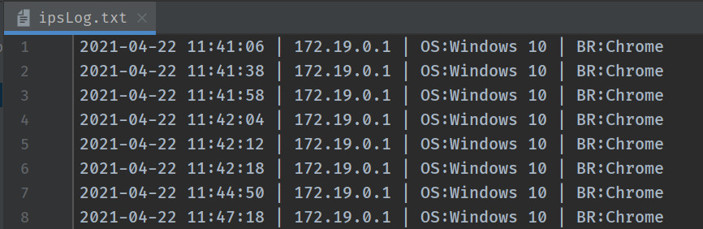

# PHP Ip Logger.

This is an easy way to record the incoming IP addresses who visiting your page in a simple text file. Additionally,
record the type of browser and operating system.

You can put the code in two ways inside the page you want to record the incoming IP's. Depending on the type of file,
select the first option if your page is **PHP** or the second option if your page is **HTML**.

In the first case of **PHP** copy the file `IpLogger.php` to the same folder as the file you pasted the code.<br>
Otherwise in the second case of **HTML** copy the file `IpLogger.php` and the file `IpLoggerApi.php` in the same folder
as the file where you pasted the **JavaScript** code.

## Before you start

1. Copy the `IpLogger.php` and `IpLoggerApi.php` files to the same folder as the page where you want to record incoming
   traffic IP addresses.
1. Copy the code to the page where you want to record the incoming traffic IP addresses at the bottom of the page before
   the `</body>` tag.
    1. If your page is **PHP** paste the php code. (The `IpLoggerApi.php` file is not required)
    1. If your page is **HTML** paste the Javascript code.
1. Open the text file that will be created to see the IP logs that have been created.

### This is code for PHP

```php
<?php
    require_once "./IpLogger.php";
    $logger = new IpLogger();
    $logger->write('ipsLog.txt', 'Europe/Athens');
?>
```

### This is code for HTML/JavaScript

```javascript
<script>
    CallIpLogger();
    function CallIpLogger() {
       let xhttp = new XMLHttpRequest();
       let url = "IpLoggerApi.php";
       xhttp.open("GET", url, true);
       xhttp.send();
    }
 <script>
```

## Settings

By changing the settings in the call of method **write** you can have

1. In the first member the name of the file where the network addresses will be stored.
1. Ιn the second member the time zone you belong to so that you can record the correct time. Find here
   a [list of all timezones](https://unicode-org.github.io/cldr-staging/charts/37/supplemental/zone_tzid.html)

```php
$logger->write('ipsLog.txt', 'Europe/Athens');
```

You can also change the method you called to record more data. This way you will be able to see the country, the city
and other details. But be careful because this causes a delay due to the fact that it requires closures in external
service and is still in a trial version.

```php
$logger->writeExtra('ipsLog.txt', 'Europe/Athens');
```

## Thanks to

The Trusted Source for IP Address Data <https://ipinfo.io/>

---

